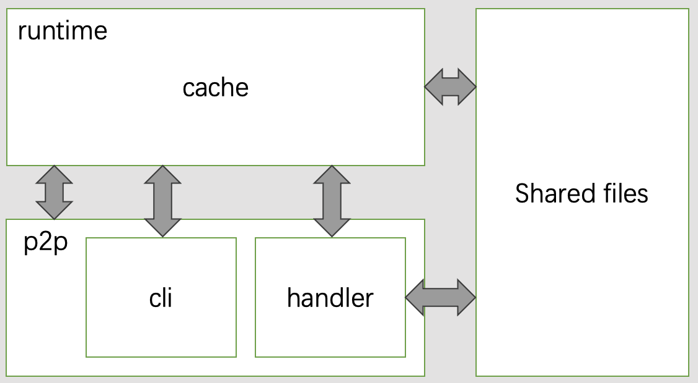

# P2PFileSharing
File sharing in P2P manner through LAN  


[](https://github.com/MGMCN/P2P-File-Sharing/issues?logo=github)
[](https://github.com/MGMCN/P2P-File-Sharing/blob/main/LICENSE)

## Architecture
Peer will start a non-blocking listener service to receive requests from other nodes and pass them to the handler. It will also start a non-blocking service to listen for input from stdin and forward these commands to the handler or CLI for execution. For example, we can request the CLI to check which nodes are online, and it will retrieve the data from the cache and provide the information. Similarly, when we want to download a file, we provide the handler with the information of the file, and it will send a download request on our behalf. Additionally, the handler will be called back when it receives a request from another node. 
It is important to note that the cache contains runtime data, including details about the currently online nodes and files shared by other nodes.  

  

## Usage
Build p2pnode from source code.
```bash
$ go get -t github.com/libp2p/go-libp2p@v0.28.0   
$ go mod tidy
$ go build -o p2pnode
```
Enter ```-help``` option to view usage.
```bash
$ ./p2pnode -help
Peer-to-peer file sharing over LAN.
  -help
    	Display Help
  -host string
    	The bootstrap node host listen address
    	 (default "0.0.0.0")
  -port int
    	node listen port
    	 (default 6666)
  -rendezvous string
    	Unique string to identify group of nodes. Share this with your friends to let them connect with you
    	 (default "default")
  -src string
    	Path to shared directory
    	 (default "./")
```
## Example
Create a directory for peer1 and store a test file. Please note that all files under this directory will be discovered by other nodes within the LAN.
```bash
$ ls
.
├── p2pnode
└── peer1.txt
$ cat peer1.txt
hello from peer1
```
Create a directory for peer2 and store a test file.
```bash
$ ls
.
├── p2pnode
└── peer2.txt
$ cat peer2.txt
hello from peer2
```
Execute the following command in each node's directory to start the two nodes respectively, it should be noted that the ports cannot conflict.
```bash
$ ./p2pnode -port 6667 # peer1:6667 peer2:6668
2023/06/25 11:15:12 Peer listening on: 0.0.0.0 with port: 6667 hostID: QmWjGSAJxhKzDqD9QTmHt9XBe5coDJdgZUWJv4ecDQPrRW
```
The ```peer echo``` command sends a hello message to all nodes within this LAN and also receives their replies.
```bash
2023/06/25 11:15:12 Peer listening on: 0.0.0.0 with port: 6667 hostID: QmWjGSAJxhKzDqD9QTmHt9XBe5coDJdgZUWJv4ecDQPrRW
peer echo
2023/06/25 11:15:23 Hello from QmdixMouioQwsBxWo1Bj3US3Q5YujB1KLsY2jSa1XCbptH
```
The ```peer search``` command will search for resources of all online nodes in the current LAN.
```bash
2023/06/25 11:15:12 Peer listening on: 0.0.0.0 with port: 6667 hostID: QmWjGSAJxhKzDqD9QTmHt9XBe5coDJdgZUWJv4ecDQPrRW
peer echo
2023/06/25 11:15:23 Hello from QmdixMouioQwsBxWo1Bj3US3Q5YujB1KLsY2jSa1XCbptH
peer search
2023/06/25 11:15:29 UpdateOthersSharedResources from QmdixMouioQwsBxWo1Bj3US3Q5YujB1KLsY2jSa1XCbptH
```
The ```cache list``` command allows you to view the details of the shared resources in the current LAN.
```bash
2023/06/25 11:15:12 Peer listening on: 0.0.0.0 with port: 6667 hostID: QmWjGSAJxhKzDqD9QTmHt9XBe5coDJdgZUWJv4ecDQPrRW
peer echo
2023/06/25 11:15:23 Hello from QmdixMouioQwsBxWo1Bj3US3Q5YujB1KLsY2jSa1XCbptH
peer search
2023/06/25 11:15:29 UpdateOthersSharedResources from QmdixMouioQwsBxWo1Bj3US3Q5YujB1KLsY2jSa1XCbptH
cache list
2023/06/25 11:15:32 We share the following resources: | p2pnode ( 30002322 bytes ) | peer1.txt ( 17 bytes )
2023/06/25 11:15:32 Resource             | Size           | Peers
2023/06/25 11:15:32 p2pnode              | 30002322 bytes | [QmdixMouioQwsBxWo1Bj3US3Q5YujB1KLsY2jSa1XCbptH]
2023/06/25 11:15:32 peer2.txt            | 17 bytes       | [QmdixMouioQwsBxWo1Bj3US3Q5YujB1KLsY2jSa1XCbptH]
```
The ```peer download resourceName``` command can download the shared resources within the current LAN, and if there are multiple nodes with the same resource, the resources will be downloaded from multiple nodes in parallel.
```bash
2023/06/25 11:15:12 Peer listening on: 0.0.0.0 with port: 6667 hostID: QmWjGSAJxhKzDqD9QTmHt9XBe5coDJdgZUWJv4ecDQPrRW
peer echo
2023/06/25 11:15:23 Hello from QmdixMouioQwsBxWo1Bj3US3Q5YujB1KLsY2jSa1XCbptH
peer search
2023/06/25 11:15:29 UpdateOthersSharedResources from QmdixMouioQwsBxWo1Bj3US3Q5YujB1KLsY2jSa1XCbptH
cache list
2023/06/25 11:15:32 We share the following resources: | p2pnode ( 30002322 bytes ) | peer1.txt ( 17 bytes )
2023/06/25 11:15:32 Resource             | Size           | Peers
2023/06/25 11:15:32 p2pnode              | 30002322 bytes | [QmdixMouioQwsBxWo1Bj3US3Q5YujB1KLsY2jSa1XCbptH]
2023/06/25 11:15:32 peer2.txt            | 17 bytes       | [QmdixMouioQwsBxWo1Bj3US3Q5YujB1KLsY2jSa1XCbptH]
peer download peer2.txt
2023/06/25 11:15:45 Caculated fileChunkSize:17 bytes
2023/06/25 11:15:45 Received file chunk from QmdixMouioQwsBxWo1Bj3US3Q5YujB1KLsY2jSa1XCbptH
2023/06/25 11:15:45 Merge chunk of peer2.txt successfully
```
The ```peer leave``` command causes the current node to gracefully exit the LAN.
```bash
2023/06/25 11:15:12 Peer listening on: 0.0.0.0 with port: 6667 hostID: QmWjGSAJxhKzDqD9QTmHt9XBe5coDJdgZUWJv4ecDQPrRW
peer echo
2023/06/25 11:15:23 Hello from QmdixMouioQwsBxWo1Bj3US3Q5YujB1KLsY2jSa1XCbptH
peer search
2023/06/25 11:15:29 UpdateOthersSharedResources from QmdixMouioQwsBxWo1Bj3US3Q5YujB1KLsY2jSa1XCbptH
cache list
2023/06/25 11:15:32 We share the following resources: | p2pnode ( 30002322 bytes ) | peer1.txt ( 17 bytes )
2023/06/25 11:15:32 Resource             | Size           | Peers
2023/06/25 11:15:32 p2pnode              | 30002322 bytes | [QmdixMouioQwsBxWo1Bj3US3Q5YujB1KLsY2jSa1XCbptH]
2023/06/25 11:15:32 peer2.txt            | 17 bytes       | [QmdixMouioQwsBxWo1Bj3US3Q5YujB1KLsY2jSa1XCbptH]
peer download peer2.txt
2023/06/25 11:15:45 Caculated fileChunkSize:17 bytes
2023/06/25 11:15:45 Received file chunk from QmdixMouioQwsBxWo1Bj3US3Q5YujB1KLsY2jSa1XCbptH
2023/06/25 11:15:45 Merge chunk of peer2.txt successfully
peer leave
2023/06/25 11:15:53 Node leave gracefully
```
Now we go back to the peer1 directory. You can see that peer2.txt has been downloaded successfully.
```bash
$ ls
.
├── p2pnode
├── peer1.txt
└── peer2.txt
$ cat peer2.txt
hello from peer2
```
## Contributing
Contributions must be available on a separately named branch based on the latest version of the main branch.
## Warning
This project may have bugs, please use it with caution. However, I am continuously improving this project. (ps: Although there is still a gap between this project and a real p2p application. But we have at least achieved a distributed file transfer. ☺️)
